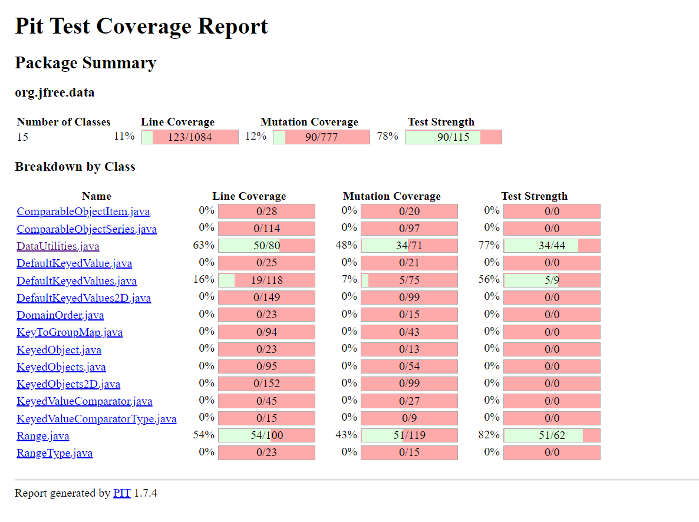
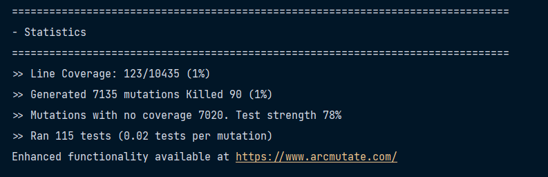
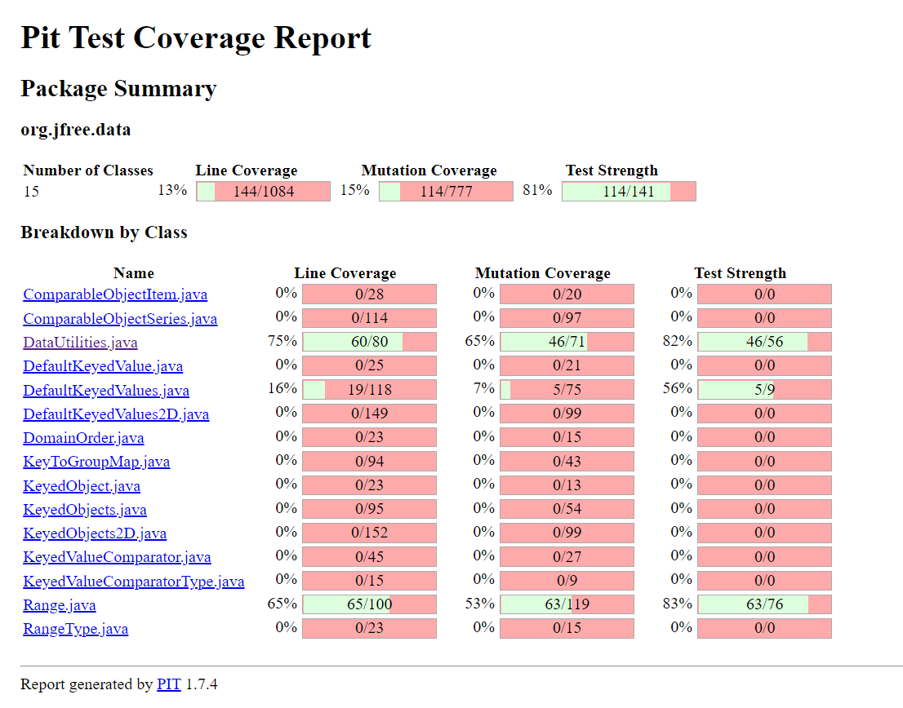

**SENG 637- Dependability and Reliability of Software Systems**
**Lab. Report \#4 – Mutation Testing and Web app testing**

| Group \#: 08       |   |
|-----------------   |---|
|Student Names:      |   |
|Mit Patel           |   |
|Dishantkumar Patel  |   |
|Jairath Chopra      |   |
|Srujan Patel        |   |

# Introduction

What is Mutation Testing? Why do we need Mutation Testing?

The goal is to assist the tester in creating effective tests or locating flaws in the program's test data or code parts that are rarely or never accessed during operation. White-box testing is a type of mutation testing.
The term "mutation" refers to a structural change. As a result, this type of software product testing entails altering the source code or penetrating tiny problem mutations. The added faults are too little to have an impact on the program's core aims. After that, both the target and mutant programmes are put to the test. The slightly altered programme is missing if the result is the same. The defective programme still remains if there are differences.

Mutation testing, also known as code mutation testing, is a type of white box testing in which testers modify certain components of an application's source code in order to ensure that a software test suite can detect the changes. Changes to the software are made with the intention of causing problems in the programme.

The purpose of mutation testing is to ensure the quality of a software testing suite, not the applications it will be used to test Unit tests are commonly conducted using mutation testing. The software test must be able to detect all altered code in order to be successful. Changes (also known as mutations) can be made by changing an existing line of code to a different value. A statement may, for example, be deleted or duplicated, true or false expressions could be changed, and other variables could be adjusted.

In most cases, mutations to a program's code are minor and only affect one variable, resulting in a fault or defect. Mutants are created when multiple versions of the original programme are created, each with its own mutation. The mutants, as well as the original application, are next put to the test. After the tests are completed, the results should be compared to the original software test.

If the tests with the mutants uncover the same number of flaws as the original programme, testers will know that either the code failed to execute, or the software testing suite employed failed to identify the mutations. After that, the software testing suite should be improved to make it more effective. Once the testing software has been improved, the mutants can be preserved and used in another code mutation test. If the mutants' test results differ from the original programmes, with the software test recognising the mutants' flaws, the mutants can be destroyed or killed.
The mutation score can then be used to score the software test suite. The mutation score is calculated by multiplying the proportion of died mutants by the total number of mutants.

# Link of demo video 

Make a video of the demo and put its link here.
All members must participate in the demo and the video should not be longer than 10 minutes.

# Analysis of 10 Mutants of the Range class 
In this section we will do analysis of least 10 mutants produced by Pitest for the Range class, and how they are killed or not by our original test suite. We are providing 5 instances where the mutant got killed and 5 where it didn't

1. Pitest replaced double return with 0.0d for org/jfree/data/Range::getLowerBound → KILLED
2. Pitest replaced double return with 0.0d for org/jfree/data/Range::getUpperBound → KILLED
3. Pitest replaced boolean return with true for org/jfree/data/Range::intersects → KILLED
4. Pitest replaced return value with null for org/jfree/data/Range::combineIgnoringNaN → KILLED
5. Pitest replaced double return with 0.0d for org/jfree/data/Range::min → KILLED
6. Pitest replaced double return with 0.0d for org/jfree/data/Range::min → NO_COVERAGE
7. Pitest removed call to org/jfree/chart/util/ParamChecks::nullNotPermitted → SURVIVED
8. Pitest replaced boolean return with true for org/jfree/data/Range::equals → NO_COVERAGE
9. Pitest replaced int return with 0 for org/jfree/data/Range::hashCode → NO_COVERAGE
10. Pitest replaced boolean return with true for org/jfree/data/Range::intersects → SURVIVED
# Report all the statistics and the mutation score for each test class

Img1

Mutation Score (Can be inferred from the above image) is 48% for the DataUtilities Class and 43% for the Range Class

Statistics can be inferred from the Img2 when pitclipse is run on the org.jfree.data.* package

Img2

# Analysis drawn on the effectiveness of each of the test classes

Range Class
This class has a mutation coverage of 43%. 

Tests Examined:
- org.jfree.data.RangeTest.shiftTest(org.jfree.data.RangeTest) (0 ms)
- org.jfree.data.RangeTest.isNaNRangeTest(org.jfree.data.RangeTest) (0 ms)
- org.jfree.data.RangeTest.intersectsTest(org.jfree.data.RangeTest) (0 ms)
- org.jfree.data.RangeTest.combineIgnoringNaNTest(org.jfree.data.RangeTest) (0 ms)
- org.jfree.data.RangeTest.expandToIncludeTest(org.jfree.data.RangeTest) (0 ms)

Active Mutators Found:

- CONDITIONALS_BOUNDARY
- EMPTY_RETURNS
- FALSE_RETURNS
- INCREMENTS
- INVERT_NEGS
- MATH
- NEGATE_CONDITIONALS
- NULL_RETURNS
- PRIMITIVE_RETURNS
- TRUE_RETURNS
- VOID_METHOD_CALLS

Most mutants that did not get killed are because of no coverage. Since our code does not cover test cases for all the methods, this is expected.

DataUtilities Class

This class has a better mutation coverage thaan the Range class with 48% mutation coverage

Tests Examined:
- org.jfree.data.DataUtilitiesTest.testcalculateColumnTotal_1(org.jfree.data.DataUtilitiesTest) (0 ms)
- org.jfree.data.DataUtilitiesTest.testcalculateColumnTotal_2(org.jfree.data.DataUtilitiesTest) (16 ms)
- org.jfree.data.DataUtilitiesTest.getCumulativePercentages(org.jfree.data.DataUtilitiesTest) (516 ms)
- org.jfree.data.DataUtilitiesTest.testcalculateRowTotal_1(org.jfree.data.DataUtilitiesTest) (0 ms)
- org.jfree.data.DataUtilitiesTest.testcalculateRowTotal_2(org.jfree.data.DataUtilitiesTest) (0 ms)

Active Mutators Found:

- CONDITIONALS_BOUNDARY
- EMPTY_RETURNS
- FALSE_RETURNS
- INCREMENTS
- INVERT_NEGS
- MATH
- NEGATE_CONDITIONALS
- NULL_RETURNS
- PRIMITIVE_RETURNS
- TRUE_RETURNS
- VOID_METHOD_CALLS

In this case as well most of the mutants that did not get killed are because of no coverage. Since our code does not cover test cases for all the methods, this is expected.
# A discussion on the effect of equivalent mutants on mutation score accuracy

Equivalent mutants are mutants that behave exactly like orignal code. This means that it is in their nature to hide within the program and act in a way that mimics the behaviour of the original source code under test.

The occurrence of equivalent mutations has an impact on mutation testing's quantitative mutation score accuracy. Equivalent mutants, in particular, allow for a block of code under examination to have a higher mutation score in fact than the tool displays. Furthermore, some modifications are not detectable by test cases, such as the post incrementation of a returned value, which has no impact on production code and will not be discovered. As a result of situations like this, the mutation score may be less precise. Therefore, it can be concluded that while mutation score is a helpful tool test for getting a general idea of the code's robustness, but it should not be used to decide whether code is ready and adequately tested enough to be put to production.

As it was suggested in the report guidelines, we looked at the Pitest report for mutants that had not been killed in order to find equivalent mutants. We made one observation that generally it was an equivalent mutant when a mutant developed from modifying the conditional values and survived. As a result, identifying equivalent mutations was a combination of reading the Pitest report and looking at the source code simultaneously.

# A discussion of what could have been done to improve the mutation score of the test suites
We looked at the mutant logs to see which mutants made it through our tests. During this step, we tried to skim through the log for the largest red regions, which represent a large number of mutants that survived. We tried to jot down as much as we could and prioritise which areas we should work on first based on our group's familiarity. Then we wrote more unit tests in order to increase the mutation score by the required amount (10%), as suggested in the assignment guidelines.

Img3

We have added the following to improve the mutation score (as infered from img3):-
- org.jfree.data.RangeTest.testEquals(org.jfree.data.RangeTest) (0 ms)
- org.jfree.data.RangeTest.testConstrain(org.jfree.data.RangeTest) (0 ms)
- org.jfree.data.RangeTest.testToString(org.jfree.data.RangeTest) (16 ms)
- org.jfree.data.DataUtilitiesTest.testEqual(org.jfree.data.DataUtilitiesTest) (0 ms)

# Why do we need mutation testing? Advantages and disadvantages of mutation testing

Objective of Mutation Testing:
-	To find code that hasn't been well tested.
-	To find hidden flaws that other testing methods are unable to detect.
-	To find new types of flaws or problems.
-	To figure out the mutation score.
-	Error propagation and state infection in the programme will be investigated.
-	To evaluate the test cases' quality

Advantages of Mutation Testing:
-	After this testing, customers receive the most stable and reliable system.
-	Mutation testing can detect all flaws in source code.
-	It is possible to achieve a high level of coverage of the source software.
-	Mutants in the programme are rigorously tested.
-	The software program's quality has improved.
-	It is possible to find flaws in test data.

Disadvantages of Mutation Testing:
-	It's tough to put complex alterations into practise.
-	Testing for mutations is time-consuming and costly.
-	To perform mutation testing, testers must have programming skills.
-	Because it entails a lot of source code modifications, mutation testing isn't appropriate for black-box testing.
-	The original test suite must be used to test large mutant programmes.
-	Mutation testing is time-consuming, automation is required.

# Explain your SELENUIM test case design process

Firstly, our team got familiar with the Selenium IDE and its playback features. We explored the website that we were going to test throughout this round of the testing process. We tried to understand how the website is laid out and what features could be selected for testing. 

We did several trial runs at writing Selenium test cases, as we would become familiar with the spots in our scripts where assertions would be added when we really ran our tests.

Then we execute our designed test cases and record them in SeleniumIDE. We went over our mock test scripts and run them in SeleniumIDE. We reviewed the SeleniumIDE-generated test script to ensure that the assertions we built were successfully captured. We then went back over the video footage to make sure the test case had caught all we wanted it to.

# Explain the use of assertions and checkpoints

Selenium uses assertions and checkpoints (also known as validations) to ensure that the system operates as anticipated. The application takes care of this automatically, making them simple to use. These validations are added by Selenium following any type of user input, such as a mouse click, scrolling, or entering text. If one of the inputs is unexpected or erroneous, the test case will come to a halt and fail at that checkpoint. If the assertion fails, this functions similarly to JUnit testing, which returns a failure.
# how did you test each functionaity with different test data

# Discuss advantages and disadvantages of Selenium vs. Sikulix

Advantages of Selenium Testing:
-	Selenium is a free and open-source application.
-	Selenium allows you to develop programmes in a variety of programming languages (Test scripts)
-	Selenium is compatible with a wide range of operating systems (MS Windows, Linux, Macintosh etc...)
-	Selenium works with a variety of browsers (Mozilla Firefox, Google Chrome, IE, Opera, Safari etc...)
-	Parallel test execution is supported by Selenium.
-	Selenium consumes a smaller amount of hardware resources.

Disadvantages of Selenium Testing:
-	There is no one who can provide reliable technical support.
-	It only works with web-based applications.
-	Difficult to use; creating test cases takes longer.
-	When compared to vendor tools such as UFT, RFT, Silk Test, and others, it is more difficult to set up a test environment.
-	Image testing has limited support.
-	There's a chance that some of the new features won't work properly.
-	There is no integration with a test tool for test management.
-	There is no built-in reporting feature.

Advantages of Sikulix Testing:
-	It's completely unrelated to the platform.
-	Can do any type of user interface (GUI) testing, cross-platform testing, and browser compatibility testing on the web.
-	Excellent readability
-	The code is intelligible, and the logical relationship represented by graphics is more vibrant, colourful, understandable, and maintainable.
-	Make a.jar package available.
-	Building a large-scale test framework and recognising the complementarity between diverse test tools is simple.
-	The design of use cases and the execution of programmes can be separated.
-	Use case designers can only focus on graphical logical relationships and test checkpoints and do not need to grasp specific development and programming language foundations; programme implementers can only conduct programming and do not need to be involved in the design process.

Disadvantages of Sikulix Testing:
-	Because Sikulix does not support Chinese, you will be unable to programme or save the path in Chinese! Otherwise, an error will be reported by the operation.
-	The effect of the picture's resolution, colour, size, and distinctiveness on the programme (if there are two identical, it is impossible to distinguish which one)
-	Sikulix is not flawless (it is still in the development and upgrading stages), there are still numerous software errors, and it is unclear whether it will be able to continue to improve.
-	Only recognise the icon that is currently active (only the current desktop has it)
-	The use case organisation is available, however there are currently issues, and the convenience has yet to be studied.
-	If you take a screenshot, the script storage takes up a lot of space.
-	The adjustment of similarity necessitates one-by-one manual adjustments, which takes a long time.

# How the team work/effort was divided and managed
Firstly, we read whole assignment and discussed what should we do to complete this assignment and we all understood about mutaion testing. We were required to write more unit tests in order to improve the mutation coverage. Each member wrote unit test for one method.  
# Difficulties encountered, challenges overcome, and lessons learned
The main difficulty was related to setting up the project environment in Eclipse/Intellij. Even after injecting all the dependencies PiTest didn't execute. PiTest did not work with JDK 17. We didn’t encounter much trouble in doing testing. Through the lab we learned how to do mutaion testing in a structured manner and got to know how the whole process is executed by industry professionals. We also got to learn about GUI testing using Selenium/Sikulix which are very relevant tools in the QA industry today.
# Comments/feedback on the lab itself
The lab proved to be very informative exercise to unit testing using JUnit, and using test frameworks like Mockito, what is and how to do mutation testing, what are advantages and disadvantages of mutation testing, and using selenium and sikuli for doing GUI testing.
